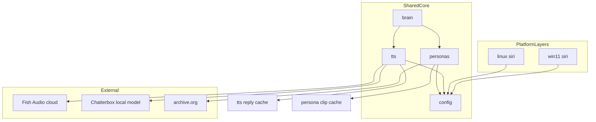
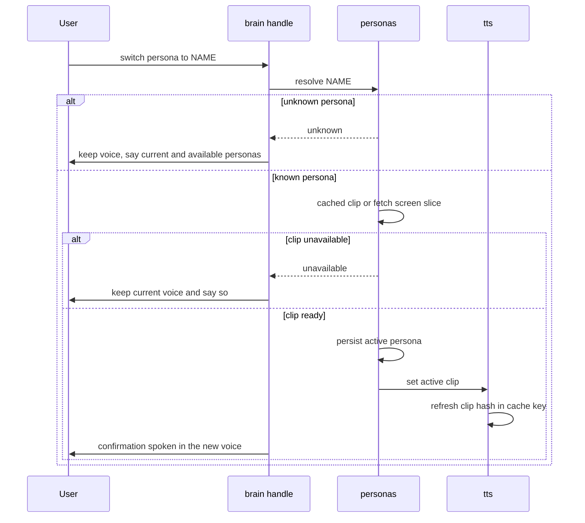
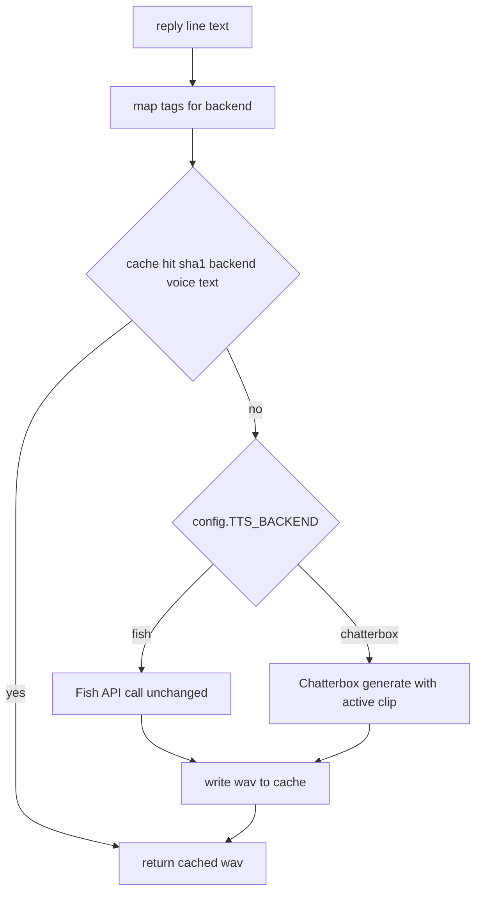

# Design — tts-alternatives (backend switch, local Chatterbox voice, persona switching)

---
**Purpose**: Provide sufficient detail to ensure implementation consistency across different implementers, preventing interpretation drift.
**Approach**: Essential sections only; diagrams over prose; discovery background stays in `research.md`.
---

## Overview

**Purpose**: This feature lets hey-jev speak through a selectable open-source TTS backend (Chatterbox, MIT, local CPU) instead of only the Fish Audio cloud API, and lets the user switch the assistant's persona — the app finds a suitable public-domain clip itself, caches it per persona, and speaks with that voice.

**Users**: The single end user running the app on win11 or linux (voice at the mic, or the browser remote). Operators run the same code with `--text` for diagnosis.

**Impact**: Changes the TTS path only. `brain.fetch_tts()` remains the single seam every caller uses (local say, remote wav streaming, reminder pre-render, warm cache); behind it a new backend dispatcher selects the Fish call (unchanged) or a local Chatterbox render. A new persona module adds the switch command, the persona catalog, and a per-persona clip cache. Platform layers only gain two path overrides.

### Goals
- One config value selects the TTS backend; Fish stays default and byte-for-byte unchanged in behavior.
- The local backend keeps the reply cache, warm-up, tag expressiveness, and a consistent cloned voice.
- Persona switching works from a single spoken/typed command with automatic clip sourcing and offline reuse.
- Prerequisite repair: `WHISPER_MODEL` / `WHISPER_LANGUAGES` become real `config` attributes (they are referenced today but undefined — latent `AttributeError`).

### Non-Goals
- Flipping the default backend away from `fish` (post-Nov-2026 decision).
- GPU serving or self-hosting Fish S2 Pro.
- Non-English synthesis on the local backend (English-only Chatterbox Turbo/Nano line).
- Persona switching while the cloud backend is active.
- Client-side (web remote) overrides of TTS settings — server-operator configuration only.
- Changes to the remote protocol, STT, decision routing, or quota logic.

## Boundary Commitments

### This Spec Owns
- The TTS backend dispatch contract: `config.TTS_BACKEND` ∈ {`fish`, `chatterbox`} and the `fetch_tts(text) → (path, ms, cached)` seam semantics for both backends.
- The tag mapping table (Fish tags → Chatterbox tags, strip fallback) and its invariant (no unknown tag is ever spoken).
- Voice identity: the reference-clip setting, the bundled default clip, clip-content hashing into the reply cache key.
- The persona domain: catalog (curated public-domain entries), clip fetch + license screening + slicing/resampling, per-persona clip cache, active-persona persistence, the switch/list command behavior.
- Startup validation for everything above (backend names, clip presence, language gate, local-model importability).
- New files: `shared/tts.py`, `shared/personas.py`, `shared/tests/`, `shared/requirements-tts-local.txt`, `assets/voice-default.wav`.

### Out of Boundary
- Fish cloud API behavior and pricing (unchanged; owned by the existing `backend_fish` path).
- Decision/LLM routing, quota, keys, memory, timers — brain domains this feature does not touch except the two routing hooks (persona action dispatch, `fetch_tts` delegation).
- Remote server protocol and quota (it keeps calling `brain.fetch_tts` / patched `brain.say` unchanged).
- Platform audio playback (`play_wav_hook` implementations) and STT (`Whisper` usage) — reused as-is.
- Curating new persona catalog entries over time (design fixes the initial set + format; growth is a later concern).

### Allowed Dependencies
- Upstream: `shared/config` module attributes (the project's global-patch contract — reads must be `config.X`), the existing cache directory conventions, `requests`, `numpy`/`soundfile` (already platform dependencies).
- New external: `chatterbox-tts` (+ its torch CPU transitive tree) — optional install via `shared/requirements-tts-local.txt`; imported lazily, only when `TTS_BACKEND="chatterbox"`.
- External service: archive.org item/metadata endpoints for persona clip sources (curated catalog only — never arbitrary user-supplied URLs).
- Constraint: no new system-level tool requirement at runtime (no ffmpeg dependency; slicing/resampling is numpy/soundfile in-process).

### Revalidation Triggers
- Chatterbox model card/API changes (generate signature, tag list, sample rate).
- Reply-cache key formula change → all platforms must invalidate caches together.
- Persona catalog schema change → persisted persona files and cache layout.
- Adding a backend → dispatch contract, startup validation, and the language gate must be re-checked.

## Architecture

### Existing Architecture Analysis
- `shared/brain.py` is the platform-neutral monolith; platforms (`win11/siri.py`, `linux/siri.py`) wire hooks (`play_wav_hook`, `machine_context_hook`, `APPS`, `ACTIONS`) into `shared/config.py` right after import. This pattern is preserved: new modules read only `config.X` attributes and never bind them at import (project invariant #1 — from-imports freeze values the remote server patches per turn).
- `brain.fetch_tts()` is the single TTS seam; `remote_server.py` streams its result as wav bytes and patches `brain.say` per turn. Both keep working because the seam signature is unchanged.
- Known latent bug in the current tree: `config.WHISPER_MODEL` / `config.WHISPER_LANGUAGES` are referenced (remote_server, both platform `siri.py`) but defined nowhere; only the legacy mac `siri.py` has a module-local. This feature defines both in `shared/config.py` because the language gate (5.2) depends on them.

### Architecture Pattern & Boundary Map



- **Selected pattern**: seam-preserving dispatch — one seam (`fetch_tts`), one dispatcher (`shared/tts.py`), one new domain module (`shared/personas.py`). Chosen over modifying brain in place because the backend/persona logic is independently testable and the brain stays within its patch contract.
- **Dependency direction**: `config ← tts ← brain` and `config ← personas ← brain`; platform layers import brain/config and wire paths. tts and personas never import brain (no cycles, remote-server patches stay intact).
- **Existing patterns preserved**: module-attribute config reads; daemon threads for background work (warm-up, reminder prep); content-hash cache filenames; atomic JSON writes (`.tmp` + `os.replace`) as in `save_timers`.
- **New components rationale**: `tts.py` isolates the vendor-specific render (Fish call moved verbatim; Chatterbox added) so brain keeps routing only; `personas.py` owns a new domain (catalog, licensing screen, clip cache) that has nothing to do with routing.
- **Steering compliance**: fail fast at startup (validation), graceful degradation at runtime (render failures never end the session), secrets unchanged (no new keys; Chatterbox is local).

### Technology Stack

| Layer | Choice / Version | Role in Feature | Notes |
|-------|------------------|-----------------|-------|
| Local TTS engine | `chatterbox-tts` (Chatterbox-Turbo line, `nano=True` default) | Render speech locally, paralinguistic tags, clip-based voice cloning | Optional install; imported lazily; CPU `device="cpu"` |
| Audio IO | `soundfile` + `numpy` (existing) | Read fetched mp3 clip, slice, resample to 24 kHz mono, write wav | libsndfile ≥ 1.2 reads mp3; no ffmpeg at runtime |
| Backend switch | `config.TTS_BACKEND` module attribute | Dispatch fish/chatterbox; per-turn patchable like all config | `"fish"` default |
| Remote sources | archive.org advancedsearch + metadata endpoints (existing APIs, exercised in research) | Persona clip discovery metadata | Curated catalog entries only |
| Test | `pytest` (new in this feature) | Unit/integration for tts, personas, brain routing | `shared/tests/` |

## File Structure Plan

```
assets/
└── voice-default.wav             # NEW: bundled default persona clip (copy of alternatives/doc/voice-ref-clip.wav)
shared/
├── tts.py                        # NEW: backend dispatch, tag mapping, clip hashing, Chatterbox wrapper, Fish call (moved verbatim)
├── personas.py                   # NEW: catalog, license screening, clip fetch/slice/cache, active-persona persistence
├── requirements-tts-local.txt    # NEW: optional chatterbox-tts pin for both platforms
├── requirements-dev.txt          # NEW: dev-only pytest (task 1.1 approval addition)
├── brain.py                      # MODIFIED: fetch_tts delegates to tts.render; persona questions + routing in decide/handle
├── config.py                     # MODIFIED: TTS_*/PERSONA_* settings; defines WHISPER_MODEL/WHISPER_LANGUAGES
├── remote_server.py              # unchanged (keeps calling brain.fetch_tts / patched brain.say)
└── tests/                        # NEW: pytest units + integration
    ├── test_tags.py
    ├── test_tts_cache.py
    ├── test_personas.py
    ├── test_routing.py
    ├── test_tts_integration.py   # backend + warm-cache integration (task 4.1)
    ├── test_persona_turn.py      # turn-level persona flows (task 4.2)
    └── measure_rtf.py            # operator RTF harness, not a CI gate (task 4.3)
win11/
├── siri.py                       # MODIFIED: wire PERSONAS_CACHE_DIR + PERSONA_FILE next to TIMERS_FILE/CACHE_DIR
└── requirements.txt              # MODIFIED: pointer comment to shared/requirements-tts-local.txt
linux/
├── siri.py                       # MODIFIED: same path overrides as win11
└── requirements.txt              # MODIFIED: same pointer comment
alternatives/doc/
├── voice-ref-clip.wav            # existing sourcing artifact → copied to assets/voice-default.wav by a task
```

### Modified Files
- `shared/brain.py` — `fetch_tts` becomes a delegate to `tts.render(text)` (same signature `(path, ms, cached)`; remote_server and warm_cache callers unchanged); `QUESTIONS` gains `persona_action`; `split_questions` excludes it like the other global questions; `decide()` returns `("persona", name)` and `handle()` runs the persona flow before command execution.
- `shared/config.py` — new attributes `TTS_BACKEND`, `TTS_REF_CLIP`, `TTS_CHATTERBOX_VARIANT`, `PERSONAS_CACHE_DIR`, `PERSONA_FILE`; defines `WHISPER_MODEL = "small.en"` and `WHISPER_LANGUAGES = {"en"}` (prerequisite repair); no new secrets.
- `win11/siri.py` / `linux/siri.py` — two `config.X = ...` path overrides next to the existing `TIMERS_FILE`/`CACHE_DIR` lines; startup calls `tts.validate_startup()` before `run_voice_assistant`.
- `alternatives/doc/voice-ref-clip.wav` → `assets/voice-default.wav` — the sourced public-domain clip becomes the shipped default.

## System Flows

### Persona switch (command → voice change)



Gating decisions: the Jev fan-out classifies `persona_action` before command execution (like `timer`, it is a command that reads like a sentence); a deterministic regex ("switch persona to X", "what personas are there") overrides Jev, mirroring `memory_override` — Jev alone is not trusted for exact-name capture.

### TTS render (per line, both backends)



Key decisions: the clip identity is the clip's content hash, so a swapped clip invalidates exactly its own lines (4.2); `warm_cache` and the remote wav path need no changes because the seam signature is untouched.

## Requirements Traceability

| Requirement (IDs) | Summary | Components | Interfaces | Flows |
|---|---|---|---|---|
| 1.1, 1.2, 1.3, 1.4 | Selectable backend | `tts.py` (dispatch), `config.py` (TTS_BACKEND), startup validation | `fetch_tts` seam; `validate_startup` | Render flow |
| 2.1, 2.2, 2.3, 2.4 | Emotion tags across backends | `tts.py` (tag map, strip fallback) | `render(text)` pre-step | Render flow |
| 3.1, 3.2, 3.3, 3.4 | Voice identity from reference clip | `tts.py` (clip resolution, bundled default), `config.py` (TTS_REF_CLIP), `assets/voice-default.wav` | `active_clip()` | Render flow |
| 4.1, 4.2, 4.3, 4.4 | Cache and warm-up preserved | `tts.py` (cache key formula), `brain.warm_cache` (unchanged) | `fetch_tts` return tuple | Render flow |
| 5.1, 5.2, 5.3 | Language scope of local backend | `config.py` (WHISPER_LANGUAGES defined), startup validation (language gate) | `validate_startup` | Startup validation |
| 6.1, 6.2, 6.3 | Graceful TTS failures | `tts.py` (error envelope), platform `run_turn` handlers (existing) | `TTSRenderError` | Render flow; error strategy |
| 7.1, 7.2 | TTS traffic boundary | `tts.py` (chatterbox path has no network), persona module (fetch is clip-only, not speech) | — | Render flow |
| 8.1, 8.2 | CPU performance envelope | `tts.py` (Nano default, lazy singleton), performance test | RTF measurement script | Render flow |
| 9.1, 9.2, 9.3, 9.4, 9.5, 9.6, 9.7 | Persona switching command | `brain.py` (persona routing), `personas.py` (resolve/list/persist) | `resolve`, `active`, `list_personas` | Persona switch flow |
| 10.1, 10.2, 10.3, 10.4, 10.5, 10.6 | Automatic clip discovery and caching | `personas.py` (catalog, license screen, fetch/slice, per-persona cache) | `clip_for(persona)` | Persona switch flow |

## Components and Interfaces

| Component | Domain/Layer | Intent | Req Coverage | Key Dependencies | Contracts |
|---|---|---|---|---|---|
| `tts.py` | shared/TTS | Dispatch backends behind the `fetch_tts` seam; tags; clip identity; Chatterbox wrapper; startup validation | 1–8 | config (P0), chatterbox-tts (P0, lazy), requests (P0, fish path only) | Service, State |
| `personas.py` | shared/Persona | Persona catalog, clip discovery/screening/fetch, per-persona cache, persistence | 9–10 | config (P0), requests (P0), soundfile+numpy (P0) | Service, State |
| brain persona routing | shared/Routing | Classify and execute persona commands in the one-turn flow | 9.1–9.4, 9.7 | tts (P0), personas (P0) | Service (Jev questions) |
| `config.py` additions | shared/Config | Feature settings + prerequisite repair | 1.x, 5.x | — | State |
| platform wiring | platform/Startup | Path overrides + startup validation call | 1.3, 3.3, 5.2 | tts (P0) | — |

### shared/tts.py

| Field | Detail |
|---|---|
| Intent | Render a reply line to a cached wav via the configured backend |
| Requirements | 1.1–1.4, 2.1–2.4, 3.1–3.4, 4.1–4.4, 6.1–6.3, 7.1–7.2, 8.1–8.2 |
| Contracts | Service, State |

**Responsibilities & Constraints**
- Owns the reply-cache key formula and both backend implementations; the Fish implementation is moved verbatim from `brain.fetch_tts` (headers, model string `s2.1-pro-free`, wav format) so cloud behavior is bit-identical.
- All reads of mutable settings are `config.X` at call time (per-turn patch contract); no from-imports.
- Never falls back to another backend on failure (6.2); failures raise `TTSRenderError(msg)` and let the existing platform/remote handlers report them.

**Dependencies**
- Inbound: `brain.fetch_tts` (delegate), `brain.warm_cache` (P0)
- Outbound: `personas.active_clip()` for the chatterbox voice (P0)
- External: Fish API (P0, fish path), chatterbox-tts (P0, lazy import), libsndfile/soundfile (P0)

**Contracts**: Service ✔ / State ✔

##### Service Interface
```python
class TTSRenderError(RuntimeError): ...

def render(text: str) -> tuple[str, int, bool]:
    """-> (wav_path, render_ms, cached) for the configured backend."""

def map_tags(text: str) -> str:
    """Fish-style [tags] -> backend tags; unknown tags stripped; never spoken."""

def active_clip() -> str:
    """Absolute path of the voice-defining clip for the local backend
    (configured clip if set, else the bundled assets/voice-default.wav)."""

def validate_startup() -> list[str]:
    """Return human-readable blocking problems; empty list = ready."""
```
- Preconditions: platform layers have wired paths and hooks; for `chatterbox`, `shared/requirements-tts-local.txt` is installed.
- Postconditions: rendered file exists under `config.CACHE_DIR`; cache filename = `sha1(f"{backend}|{clip_hash}|{mapped_text}")`.
- Invariants: unknown tags never reach synthesis (2.2); the chatterbox path performs zero network I/O (7.1); render failures raise, never swap backends (6.2).

##### State Management
- Active clip identity: content hash (first 16 hex of sha1 of the clip file), computed lazily once per clip path and refreshed on persona switch.
- Chatterbox model: lazy singleton keyed by variant (`nano` default, `turbo` optional), mirroring `_Whisper`; loaded on first render or during `validate_startup` preflight.

**Implementation Notes**
- Integration: `brain.fetch_tts` = 3-line delegate; `remote_server` untouched.
- Validation: unit tests for tag map and cache key; integration test renders one line per backend into a temp cache dir.
- Risks: torch CPU install size; libsndfile mp3 support requires soundfile ≥ 1.2 (pin accordingly); Chatterbox generate signature drift → covered by Revalidation Triggers.

### shared/personas.py

| Field | Detail |
|---|---|
| Intent | Persona catalog + automatic clip sourcing, licensing screen, per-persona cache, persistence |
| Requirements | 9.1–9.6, 10.1–10.6 |
| Contracts | Service, State |

**Responsibilities & Constraints**
- Owns the persona catalog: curated entries only; each entry carries `name`, `description`, `reader`, `source_url`, `source_license` (must be public domain or equivalent — enforced by a catalog-level check), `file`, `start_s`, `duration_s`. The bundled persona `jev` uses `assets/voice-default.wav` with no fetch.
- Fetch flow (10.1): download the cataloged file (mp3/ogg) → `soundfile.read` → slice `[start_s, start_s+duration_s]` → mono → numpy linear resample to 24 kHz → write `PERSONAS_CACHE_DIR/{name}.wav`. No ffmpeg, no other system tool.
- License screen (10.4) is enforced twice: catalog construction rejects entries without a permissive `source_license`, and fetch re-checks the item's `licenseurl` via the archive.org metadata endpoint before download; mismatch → treat as unavailable (10.5 behavior).
- Persistence: active persona in `config.PERSONA_FILE` as JSON `{"persona": name}`, atomic `.tmp` + `os.replace` write (same pattern as `save_timers`), loaded at startup.

**Dependencies**
- Inbound: brain persona routing (P0), `tts.active_clip` (P0)
- Outbound: archive.org download + metadata endpoints (P1 — failure = keep current persona, 10.5)
- External: requests (P0), soundfile+numpy (P0)

**Contracts**: Service ✔ / State ✔

##### Service Interface
```python
def resolve(name: str) -> str | None:
    """Canonical persona name or None if unknown (9.3)."""

def list_personas() -> list[dict]:
    """[{name, description, active}] for announcements (9.4)."""

def clip_for(name: str) -> str | None:
    """Cached wav path for the persona, fetching+screening on first use;
    None if unavailable (10.1, 10.5)."""

def set_active(name: str) -> None:
    """Persist the persona; the caller then points tts at clip_for(name)."""

def active() -> str:
    """Current persona name (default 'jev')."""
```
- Preconditions: `config.PERSONAS_CACHE_DIR` wired by the platform.
- Postconditions: a fetched persona has exactly one `{name}.wav` in the persona cache; `PERSONA_FILE` reflects the active persona.
- Invariants: cache is per-persona and content-stable (10.2, 10.3, 10.6); unknown persona never changes the voice (9.3).

**Implementation Notes**
- Integration: initial catalog ships with `jev` (bundled clip) plus two downloadable public-domain entries selected from LibriVox single-reader recordings (exact items picked during tasks, same screening criteria as the sourced default).
- Validation: unit tests for catalog screening and slice/resample math with a tiny synthetic mp3 fixture; integration test exercises `clip_for` twice asserting the second call does no network I/O.
- Risks: archive.org rate limits (P2 — cached after first use); libsndfile mp3 decode failure → entry marked unavailable with a console note.

### brain persona routing

| Field | Detail |
|---|---|
| Intent | Recognize and execute persona commands within the existing one-turn flow |
| Requirements | 9.1–9.4, 9.7 |
| Contracts | Service (Jev questions) |

**Responsibilities & Constraints**
- `QUESTIONS` gains `persona_action` (choice: `switch` / `list` / `none`) and `persona_name` (choice: exact catalog names + `none`); both are global-scope questions excluded from `split_questions` (like `category`/`timer` handling).
- Deterministic override first (mirroring `memory_override`): `switch persona to X`, `switch to X persona`, `list personas`, `what persona are you`; Jev answers apply when the regex misses, gated at `config.GATE`.
- `decide()` returns `("persona", action, name)` before command execution; `handle()` runs it like the memory flow — speaking the outcome through `say` (which now renders with the new clip when the switch succeeded, satisfying 9.2).

**Dependencies**
- Outbound: `personas` (P0), `tts` (P0 — clip swap + render)

**Contracts**: Service ✔ (question additions are data, not code paths)

**Implementation Notes**
- Integration: rides `brain.handle`; no changes to remote/HTTP surfaces.
- Validation: `test_routing.py` covers regex vs Jev precedence and unknown-persona replies with stubbed `config.jev`.
- Risks: Jev name capture quality — mitigated by the regex-first design.

### config.py additions (State contract)
- `TTS_BACKEND: str` (env `TTS_BACKEND`, default `"fish"`); values other than `fish`/`chatterbox` are startup-fatal (1.3).
- `TTS_REF_CLIP: str | None` (env `TTS_REF_CLIP`); unset → bundled default (3.2); set-but-missing → startup failure naming the file (3.3).
- `TTS_CHATTERBOX_VARIANT: str` (env, default `"nano"`; `"turbo"` allowed).
- `PERSONAS_CACHE_DIR`, `PERSONA_FILE` — default under `shared/`, overridden by both platforms to their own folders (existing path-override pattern).
- `WHISPER_MODEL = "small.en"`, `WHISPER_LANGUAGES = {"en"}` — prerequisite repair; platforms may override via env as they already assume.

### platform wiring (Startup contract)
- `siri.py` (both platforms) adds the two persona path overrides and calls `tts.validate_startup()` where the Fish-key checks run today, so all startup failures (1.3, 3.3, 5.2) surface before the mic opens.

## Data Models

### Domain Model
- **Persona** (aggregate): `name` (natural key), `description`, `reader`, source triple (`source_url`, `source_license`, `file`), `start_s`/`duration_s`; invariant: `source_license` permissive or the entry cannot exist.
- **PersonaClip**: cached artifact `{name}.wav`; content-stable per source; owned by the persona cache dir.
- **ActivePersona**: single-valued state persisted in `PERSONA_FILE`; default `jev`.
- **TTSReplyCache entry**: unchanged concept, key formula extended with backend + clip hash.

### Logical Data Model
- Persona cache: one file per persona, `{name}.wav`, 24 kHz mono s16; regeneration only if the file is missing (idempotent fetch).
- Reply cache: filenames `sha1(f"{backend}|{clip_hash}|{mapped_text}").wav` under the existing `CACHE_DIR`; no metadata sidecar needed.
- `PERSONA_FILE` JSON: `{"persona": "<name>"}`; written atomically; missing/corrupt file → default persona, no error.

### Data Contracts & Integration
- The active persona is not synced to web clients in this feature (the remote keeps using whatever the server speaks with); a future `persona` WS message is listed under revalidation, not built now.

## Error Handling

### Error Strategy
Fail fast at startup (`validate_startup` list rendered as the existing startup-error style), degrade gracefully at runtime: render errors and fetch errors surface as spoken/console messages and never end the session; the current voice/persona always remains active on failure.

### Error Categories and Responses
- **User errors**: unknown persona (9.3 — keep voice, list available), persona command on cloud backend (9.7 — explain, keep voice).
- **System errors**: model load failure / OOM / bad generate output → `TTSRenderError` → platform `run_turn`/remote `notify` report "Something went wrong" and the next turn proceeds (6.1); clip download failure → persona stays, spoken notice (10.5).
- **Business logic errors**: language gate refusal (5.2), missing configured clip (3.3) — both startup, both name the fix.

### Monitoring
- Console trace: per-line backend, cached/rendered ms (4.4), persona fetch results, startup validation output. No new logging framework.

## Testing Strategy

### Unit Tests (`shared/tests/`)
- `test_tags.py`: full Fish-tag table → mapped/stripped outcomes; unknown-tag strip; no-tag passthrough (2.1–2.3).
- `test_tts_cache.py`: cache key stability across text; change on backend/clip-hash change (4.1, 4.2); bundled-default resolution (3.2); missing configured clip raises (3.3).
- `test_personas.py`: catalog screening rejects non-permissive license entries (10.4); unknown resolve (9.3); slice/resample math on a synthetic fixture; persistence round-trip (9.6).
- `test_routing.py`: regex beats Jev stub; `persona_action` gating; unknown-persona reply path (9.3); cloud-backend refusal (9.7).

### Integration Tests
- One `--text` turn per backend (chatterbox tests use the real Nano model; marked slow/skippable), asserting a wav lands in a temp cache dir (1.1, 1.2).
- `warm_cache()` across both backends (4.3).
- Persona switch end-to-end: switch → confirmation renders with the new clip → restart → persona persisted (9.1, 9.2, 9.6); second `clip_for` call performs no network I/O (10.2, 10.3).

### Performance Tests
- An RTF measurement script: render N fixed lines, compare wall time to wav duration (8.1) — operator runs it on target hardware; CI only asserts the harness works.

### E2E / manual gates
- Web remote: one voice turn per backend; timer alert spoken with the active persona; cancel mid-turn unaffected.

## Security Considerations
- Clip sources are restricted to the curated catalog (no user-supplied URLs → no arbitrary-download surface); license screening is data-enforced (10.4).
- Privacy boundary: chatterbox path performs no network I/O (7.1); only clip fetches touch the network and only for public-domain catalog files.
- No new secrets or keys; `remote_server._clean_keys` is not extended (TTS settings are server-operator configuration, not client-overridable).

## Performance & Scalability
- Chatterbox-Nano on CPU targets faster-than-realtime for reply-length lines (8.1); the lazy singleton keeps RAM for one model instance shared across turns, alongside the existing Whisper singleton.
- Reply-cache + warm-cache unchanged: persona/back-end switches only invalidate via the key formula.

## Migration Strategy
- No data migration: existing `CACHE_DIR` files were keyed by `sha1(VOICE_ID|text)` under fish; with the new key formula they simply miss once and re-render (acceptable: warm-up re-renders scripted lines automatically; documented as a one-time cache rebuild).
- Rollout order (task-level): config + prerequisite repair → `tts.py` with fish delegation (behavior-identical, gates green) → chatterbox backend behind the default-off switch → personas + routing → bundled asset move + docs.
- Rollback: `TTS_BACKEND=fish` (default) keeps the pre-feature behavior except the cache-key rebuild; git revert per platform is safe because platform changes are two-line overrides + one call.

## Supporting References
- `research.md` (this folder): verified Chatterbox/fish-speech capabilities, archive.org sourcing walkthrough, license checks, and the persona-switch extension notes.
- `voice-ref-clip.wav` (this folder): sourcing artifact for the bundled default clip (25 s, 24 kHz mono, LibriVox PD, Elizabeth Klett) — copied to `assets/voice-default.wav` by a task.
